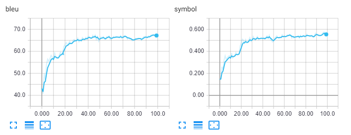

# Split-And-Recombine

This is the official code for our paper "A Split-and-Recombine Approach for Follow-up Query Analysis"(EMNLP2019).

In this paper, we propose to achieve context-dependent semantic parsing via performing follow-up query analysis, which aims to restate context-dependent natural language queries with contextual information. To accomplish the task, we propose the approach *Split-And-Recombine(StAR)*, a novel approach with a well-designed two-phase process. 

# Setup

First of all, you should setup a python environment. This code base has been tested under python 3.x, and we officially support python 3.7.

After installing python 3.7, we strongly recommend you to use `virtualenv` (a tool to create isolated Python environments) to manage the python environment. You could use following commands to create a environment.

```bash
python -m pip install virtualenv
virtualenv venv
```

Then you should activate the environment to install the dependencies. You could achieve it via using the command as below. (Please change $ENV_FOLDER to your own virtualenv folder path, e.g. venv)

```bash
$ENV_FOLDER\Scripts\activate.bat (Windows)
source $ENV_FOLDER/bin/activate (Linux)
```

The main requirement of our code base is as following:

- allennlp == 0.8.2
- pytorch >= 0.4.0
- nltk >= 3.4.3
- jupyter >= 1.0.0

You could install them via `pip` commands. We recommend you to install `pytorch` first, and then `allennlp`.

# Preprocess

Before the training, we should prepare the processed data using `preprocess.py`. The first run of preprocessing may be slow, but then the data will be cacahed into the `cache` folder. 

Note the script will automatically download data files from [FollowUp dataset](https://github.com/SivilTaram/FollowUp) and [glove pre-trained embedding](http://nlp.stanford.edu/data/glove.twitter.27B.zip).

```bash
python preprocess.py
```

Then you get the log as:

```log
Start to download FollowUp dataset from https://github.com/SivilTaram/FollowUp
Successfully unzip the FollowUp dataset and process it into `data_processed` and `data`.
Start to download Glove.twitter.27B from http://nlp.stanford.edu/data/glove.twitter.27B.zip
Start to unzip glove.zip to get the glove pre-training embedding.
Successfully unzip `glove.zip` into `glove` folder.
800it [00:03, 243.80it/s]
200it [00:00, 278.25it/s]
100%|██████████| 1000/1000 [00:00<00:00, 9142.40it/s]
```

# Pretraining model

Once the data ready, we can train a pre-training model as stated in the paper using processed data `data_processed`. For windows users, you could replace `\ ` with `^` and it will work.

```bash
python train_model.py \
       --store_folder=pretrain \
       --learning_rate=1e-3 \ 
       --margin=0.3 \
       --epoch=20 \
       --serialization_dir=split_and_recombine
```

# Reinforcement Learning model

Then we could train the Split-And-Recombine model. The training script will use the best model state in `pretrain` folder automatically. The default validation metric is `overall`, the average of symbol accuracy and bleu score.

```bash
python train_model.py \
       --store_folder=reinforce \
       --learning_rate=1e-4 
       --margin=0.3 \
       --patience=30 \
       --epoch=80 \
       --rl_basic=split_and_recombine
```

# Result

Expected result is as stated in the paper, where BLEU is ~67.05(+-1.05) and Symbol Acc is ~54.00(+-1.09). The training will last ~6 hours on a `Tesla M40` GPU. One run experiment by the author is as (the plot includes the result on pre-training):



# Cite

If you use the code, please consider citing our paper:

```bash
@inproceedings{qian2019star,
  title={A Split-and-Recombine Approach for Follow-up Query Analysis},
  author={Qian, Liu and Bei, Chen and Haoyan, Liu and Jian-Guang, Lou and Lei, Fang and Bin, Zhou and Dongmei, Zhang},
  booktitle={Proceedings of EMNLP},
  year={2019}
}
```
